# Reading Order (very important !!!)
1. [Hardware Setting](https://github.com/ChangerC77/libfranka/blob/fr3/Hardware%20Setting.md)
2. [real-time kernal.md](https://github.com/ChangerC77/libfranka/blob/dev/real-time%20kernal.md)\
Before you using `Franka FCI`, you `MUST` set up `real-time kernal` first, because `real-time kernal` will make sure that the rate of control reaches 1kHz without delay. see more details in `real-time kernal.md`

3. libfranka.md (current markdown)
4. [franka-interface](https://github.com/ChangerC77/franka-interface)
5. [frankapy](https://github.com/ChangerC77/frankapy)

# libfranka
## official reference: 
https://github.com/frankaemika/libfranka/blob/main/README.md
https://frankaemika.github.io/docs/libfranka.html

## API:
https://frankaemika.github.io/libfranka/0.15.0/

## 1. Installing dependencies
```
sudo apt-get update
sudo apt-get install -y build-essential cmake git libpoco-dev libeigen3-dev libfmt-dev
```
To use libfranka version `0.14.0` or later, you will need to install `pinocchio` and some more dependencies:
### pinocchio
1. eigen
```
sudo apt update
sudo apt install libeigen3-dev
```
2. download
```
git clone --recursive https://github.com/stack-of-tasks/pinocchio
cd pinocchio
git checkout master
mkdir build && cd build
```
3. build
注意：因为我们需要的是`C++`库，所以不需要同时生成`Python`版本的编译文件所以在`Cmake`前，要修改`Pinocchio`中的`CmakeLists.txt`文件来关闭这个选项，将下面的`BUILD_PYTHON_INTERFACE`的`ON`改为`OFF`即可。
如果一开始没有关闭`BUILD_PYTHON_INTERFACE`，会在编译时在里面`python`文件下面报错。
```
# --- OPTIONS ----------------------------------------
OPTION(BUILD_BENCHMARK "Build the benchmarks" OFF)
OPTION(BUILD_UTILS "Build the utils" OFF)
OPTION(BUILD_PYTHON_INTERFACE "Build the Python bindings" ON)
OPTION(BUILD_WITH_COMMIT_VERSION "Build libraries by setting specific commit version" OFF)
```
4. cmake
```
cmake .. -DCMAKE_BUILD_TYPE=Release -DCMAKE_INSTALL_PREFIX=/usr/local
```
5. make
```
make -j4
```
6. install
```
sudo make install
```
according to our `Robot/Gripper Server is 9`, so here we use `0.15.0` version, 

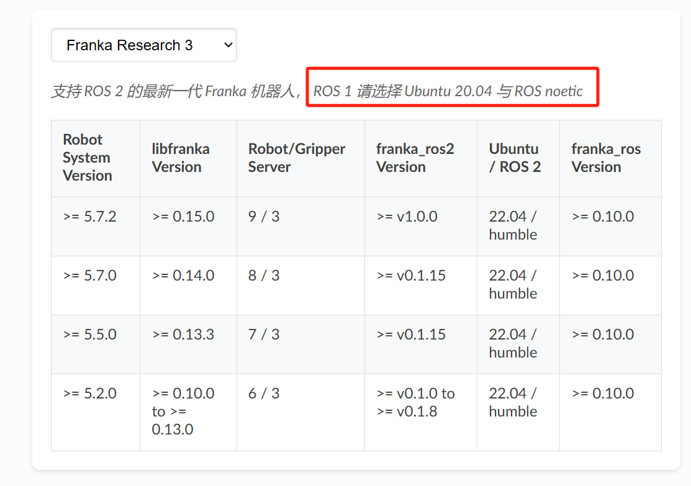

### our system version: 
`ubuntu20.04(noetic), franka_ros(0.10.0), libfranka (0.15.0)`

```
sudo apt-get install -y lsb-release curl
sudo mkdir -p /etc/apt/keyrings
curl -fsSL http://robotpkg.openrobots.org/packages/debian/robotpkg.asc | sudo tee /etc/apt/keyrings/robotpkg.asc
```
then
```
echo "deb [arch=amd64 signed-by=/etc/apt/keyrings/robotpkg.asc] http://robotpkg.openrobots.org/packages/debian/pub $(lsb_release -cs) robotpkg" | sudo tee /etc/apt/sources.list.d/robotpkg.list
```
```
sudo apt-get update
sudo apt-get install -y robotpkg-pinocchio
```
## 2. Building and Installation from Source
Before building and installing from source, please uninstall existing installations of libfranka to avoid conflicts:
```
sudo apt-get remove "*libfranka*"
```
### Clone the Repository
You can clone the repository and choose the version you need by selecting a specific tag:
```
cd ~/Franka
git clone --recurse-submodules https://github.com/frankaemika/libfranka.git
cd libfranka
```
List available tags
```
git tag -l
```
Checkout a specific tag (e.g., `0.15.0`)
```
git checkout 0.15.0
```
update submodules
```
git submodule update
```
Create a build directory and navigate to it
```
mkdir build
cd build
```
Configure the project and build
```
cmake -DCMAKE_BUILD_TYPE=Release -DCMAKE_PREFIX_PATH=/opt/openrobots/lib/cmake -DBUILD_TESTS=OFF ..
make
```
### Installing libfranka as a Debian Package (Optional but recommended)
Building a Debian package is optional but recommended for easier installation and management. In the build folder, execute:
```
cpack -G DEB
```
This command creates a Debian package named libfranka--.deb. You can then install it with:
```
sudo dpkg -i libfranka*.deb
```
`you can find this deb file in our code`

Installing via a Debian package simplifies the process compared to building from source every time. Additionally the package integrates better with system tools and package managers, which can help manage updates and dependencies more effectively.

## 3. connect
首先用网线连接机械臂底座和电脑，然后通过连接机械臂底座进入Desk设置控制器的ip地址

`ATTENTION`: 机械臂底座ip和控制器ip不能在同一域名下
- 机械臂底座连接模式下

    + `机械臂底座ip`: 192.168.0.1   
    + `本机ip`: 192.168.0.2

- FCI模式下

    + `控制器ip`: 192.168.1.10     
    + `本机ip`: 192.168.1.6

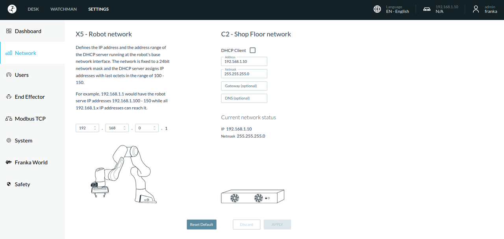
点击apply设置
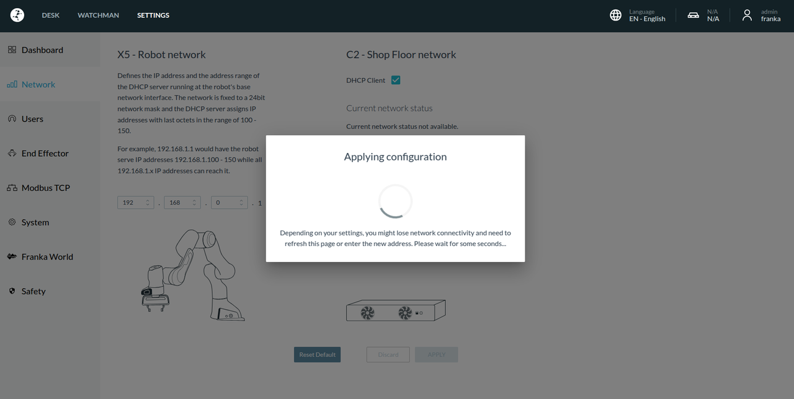

设置好后，拔掉和机械臂底座的网线连接，拿网线和控制器网口相连

`检查好网线，有些细的网线不能用，实测粗的网线可以用`

有线网络设置：在`设置/网络/有线`中添加`有线ip地址`

<div style="display: flex; justify-content: space-around; width: 80%">
    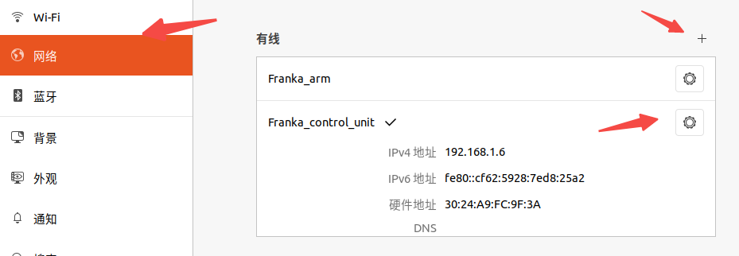
    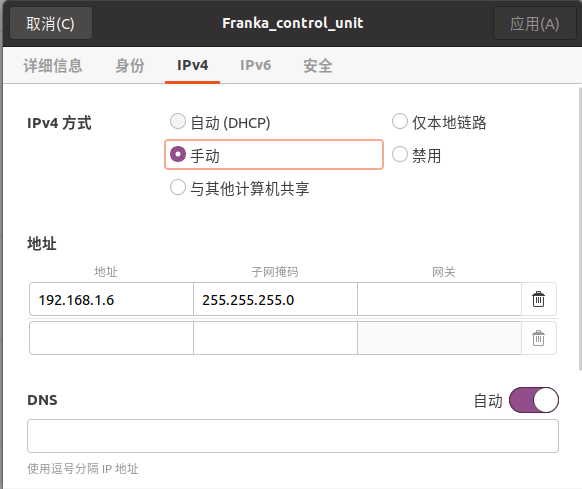
</div>

设置后可以在Dashboard中查看

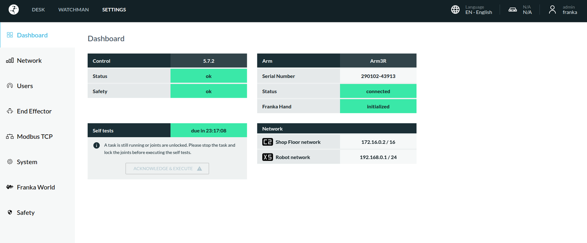

## 4. website设置
在页面中`Activate FCI`，激活后可以在`SETTINGS/System/Installed Features`看到`FCI`

<div style="display: flex; justify-content: space-around; width: 80%;">
    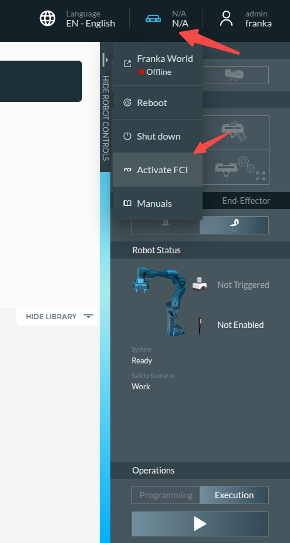 
    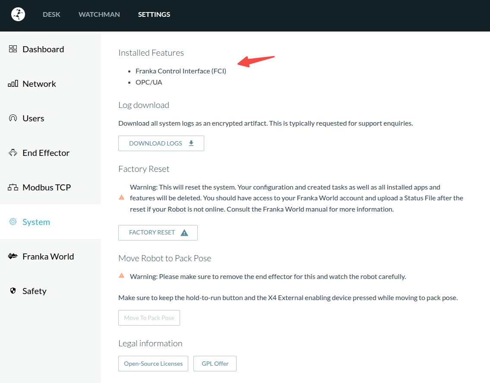
</div>

## 5. Control

<div style="display: flex; justify-content: space-around; width: 80%;">
  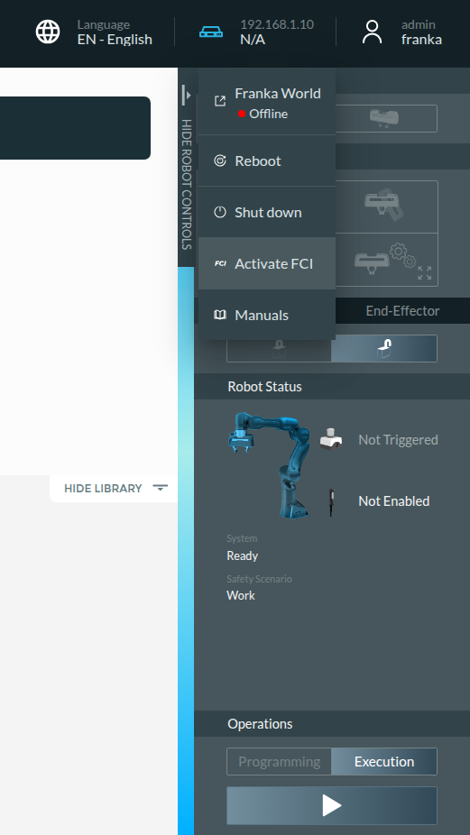
  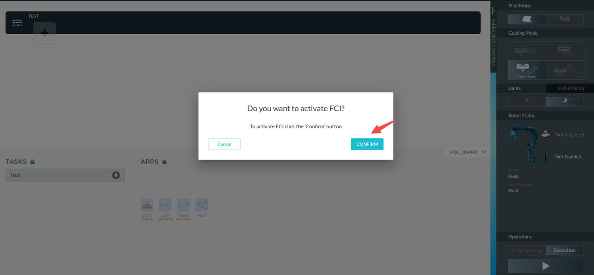
  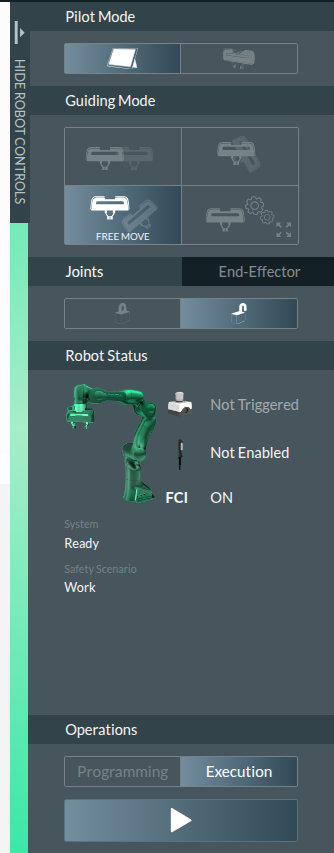
</div>

在`FCI`激活后，在`Execution`状态可以实现代码控制
```
cd ~/Franka/libfranka/build/examples
```
### 机器人回到home state
```
./communication_test 192.168.1.10
```
### 输出机器人状态
```
./echo_robot_state 192.168.1.10
```
### 机器人关节状态
获取机器人各joint相对于base frame的transform matrix
```
./print_joint_poses 192.168.1.10
```
在参数中找到q的参数
`"q": [0.0274532,-0.296549,0.20926,-2.37963,0.0801048,1.79244,0.791906],`
### 关节角度控制
```
./joint_point_to_point_motion 192.168.1.10 0.0274532 -0.296549 0.20926 -2.37963 0.0801048 1.79244 0.791906 0.1
```
最后一个是速度比例，一个参数不代表每个关节的速度一样
### 肘部运动
```
./generate_elbow_motion 192.168.1.10
```
肘部不动，关节动
### 阻抗控制
```
./cartesian_impedance_control 192.168.1.10
```
不是无节制柔性，顶得越厉害，阻碍越大，但其实回不到初始位置，阻尼会有能量损耗
### 夹爪控制
```
./grasp_object 192.168.1.10 1 0.01
```