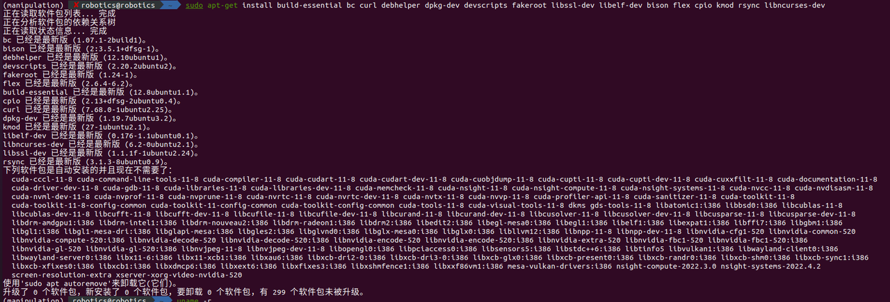
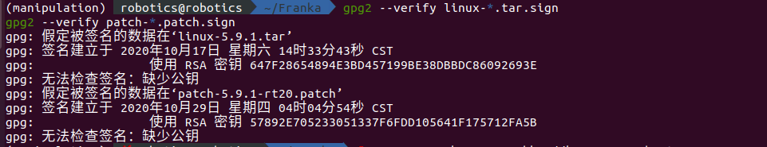
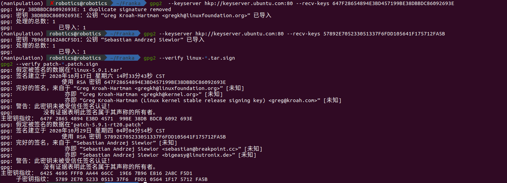
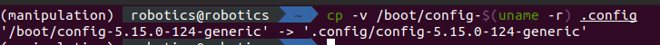
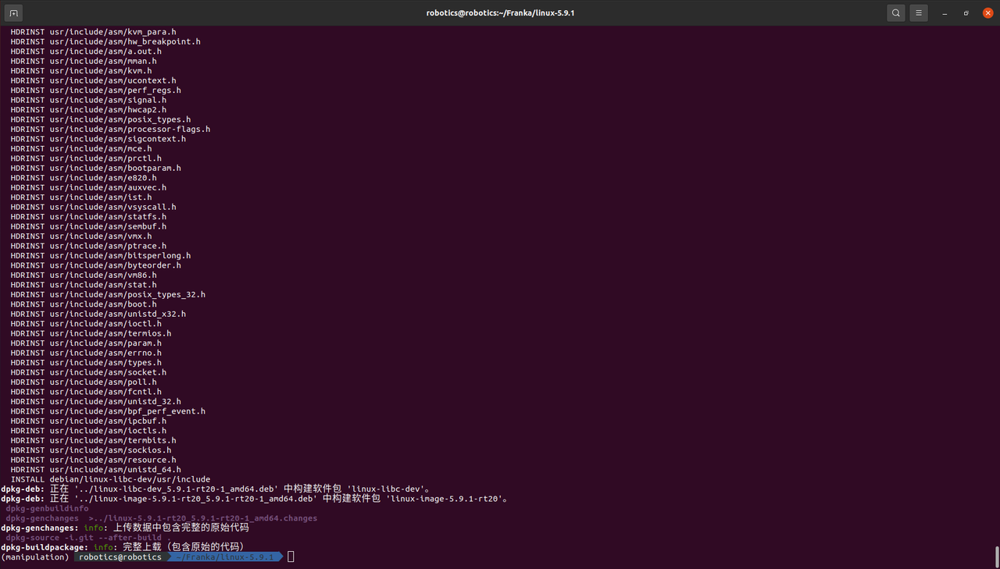
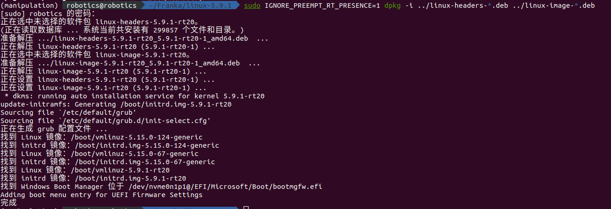

# real-time kernel (ubuntu 20.04)
official reference: https://frankaemika.github.io/docs/installation_linux.html#setting-up-the-real-time-kernel

In order to control your robot using libfranka, the controller program on the workstation PC must run with real-time priority under a PREEMPT_RT kernel. This section describes the procedure of patching a kernel to support PREEMPT_RT and creating an installation package.
> 为了使用 libfranka 控制您的机器人，工作站 PC 上的控制器程序必须在 PREEMPT_RT 内核下以实时优先级运行。本节介绍了修补内核以支持 PREEMPT_RT 并创建安装包的过程。

## NVIDIA Drivers
这里实时内核版本要和电脑内核版本对应，如果需要安装`cuda`，首先要在电脑版本中安装，而后在安装一样的实时内核版本，目前亲测`5.15`有效。

NVIDIA drivers are not officially supported on PREEMPT_RT kernels, but the installation might work anyway by passing the environment variable `IGNORE_PREEMPT_RT_PRESENCE=1` to the installation command.
> NVIDIA 驱动程序不受 PREEMPT_RT 内核的官方支持，但通过将环境变量 `IGNORE_PREEMPT_RT_PRESENCE=1` 传递给安装命令，安装仍可能有效。

## 1. software update
```
sudo apt update
sudo apt upgrade
```

## 2. install the necessary dependencies:
```
sudo apt-get install build-essential bc curl debhelper dpkg-dev devscripts fakeroot libssl-dev libelf-dev bison flex cpio kmod rsync libncurses-dev
```
output



## 3. check the kernel vision
Then, you have to decide which kernel version to use. To find the one you are using currently, use `uname -r`. Real-time patches are only available for select kernel versions, see https://www.kernel.org/pub/linux/kernel/projects/rt/. We recommend choosing the version closest to the one you currently use. If you choose a different version, simply substitute the numbers. Having decided on a version, use `curl` to download the source files:
> 然后，您必须决定使用哪个内核版本。要找到您当前正在使用的版本，请使用 uname -r。实时补丁仅适用于部分内核版本，请参阅 https://www.kernel.org/pub/linux/kernel/projects/rt/。我们建议选择最接近您当前使用的版本。如果您选择其他版本，只需替换数字即可。决定版本后，使用 `curl` 下载源文件：
```
uname -r
```
output
```
5.15.0-124-generic
```
### 5.15 (recommanded)
如果内核版本是`5.15`，并要使用`cuda`，一定安装最新的`5.15`的版本
```
mkdir ~/Franka && cd Franka
curl -LO https://www.kernel.org/pub/linux/kernel/v5.x/linux-5.15.179.tar.xz
curl -LO https://www.kernel.org/pub/linux/kernel/v5.x/linux-5.15.179.tar.sign
curl -LO https://www.kernel.org/pub/linux/kernel/projects/rt/5.15/older/patch-5.15.179-rt84.patch.xz
curl -LO https://www.kernel.org/pub/linux/kernel/projects/rt/5.15/older/patch-5.15.179-rt84.patch.sign
```
output
```
  % Total    % Received % Xferd  Average Speed   Time    Time     Time  Current
                                 Dload  Upload   Total   Spent    Left  Speed
100  120M  100  120M    0     0  4093k      0  0:00:30  0:00:30 --:--:-- 5250k
  % Total    % Received % Xferd  Average Speed   Time    Time     Time  Current
                                 Dload  Upload   Total   Spent    Left  Speed
100   993  100   993    0     0   3559      0 --:--:-- --:--:-- --:--:--  3559
  % Total    % Received % Xferd  Average Speed   Time    Time     Time  Current
                                 Dload  Upload   Total   Spent    Left  Speed
100 80596  100 80596    0     0  93934      0 --:--:-- --:--:-- --:--:-- 93825
  % Total    % Received % Xferd  Average Speed   Time    Time     Time  Current
                                 Dload  Upload   Total   Spent    Left  Speed
100   833  100   833    0     0   3947      0 --:--:-- --:--:-- --:--:--  3947
```
### 5.9.1
如果内核版本是`5.15`，不过是21年前的电脑，且不用`cuda`，可以安装`5.9`的版本, so choose to install `5.9.1`
```
mkdir ~/Franka && cd Franka
curl -LO https://www.kernel.org/pub/linux/kernel/v5.x/linux-5.9.1.tar.xz
curl -LO https://www.kernel.org/pub/linux/kernel/v5.x/linux-5.9.1.tar.sign
curl -LO https://www.kernel.org/pub/linux/kernel/projects/rt/5.9/patch-5.9.1-rt20.patch.xz
curl -LO https://www.kernel.org/pub/linux/kernel/projects/rt/5.9/patch-5.9.1-rt20.patch.sign
```
output
```
curl -LO https://www.kernel.org/pub/linux/kernel/v5.x/linux-5.9.1.tar.sign
curl -LO https://www.kernel.org/pub/linux/kernel/projects/rt/5.9/patch-5.9.1-rt20.patch.xz
curl -LO https://www.kernel.org/pub/linux/kernel/projects/rt/5.9/patch-5.9.1-rt20.patch.sign
  % Total    % Received % Xferd  Average Speed   Time    Time     Time  Current
                                 Dload  Upload   Total   Spent    Left  Speed
100  110M  100  110M    0     0  4313k      0  0:00:26  0:00:26 --:--:-- 5177k
  % Total    % Received % Xferd  Average Speed   Time    Time     Time  Current
                                 Dload  Upload   Total   Spent    Left  Speed
100   987  100   987    0     0   1958      0 --:--:-- --:--:-- --:--:--  1958
  % Total    % Received % Xferd  Average Speed   Time    Time     Time  Current
                                 Dload  Upload   Total   Spent    Left  Speed
100  158k  100  158k    0     0   141k      0  0:00:01  0:00:01 --:--:--  141k
  % Total    % Received % Xferd  Average Speed   Time    Time     Time  Current
                                 Dload  Upload   Total   Spent    Left  Speed
100   438  100   438    0     0    528      0 --:--:-- --:--:-- --:--:--   528
```

## 4. Verifying file integrity\
And decompress them with:
```
xz -d *.xz
```
The `.sign` files can be used to verify that the downloaded files were not corrupted or tampered with. The steps shown here are adapted from the Linux Kernel Archive , see the linked page for more details about the process.

``This step is optional but recommended!``
verify whether kernal install successfully
You can use `gpg2` to verify the `.tar` archives:
```
gpg2 --verify linux-*.tar.sign
gpg2 --verify patch-*.patch.sign
```
If your output is similar to the following:



```
gpg2 --verify patch-*.patch.sign
gpg: 假定被签名的数据在‘linux-5.9.1.tar’
gpg: 签名建立于 2020年10月17日 星期六 14时33分43秒 CST
gpg:                使用 RSA 密钥 647F28654894E3BD457199BE38DBBDC86092693E
gpg: 无法检查签名：缺少公钥
gpg: 假定被签名的数据在‘patch-5.9.1-rt20.patch’
gpg: 签名建立于 2020年10月29日 星期四 04时04分54秒 CST
gpg:                使用 RSA 密钥 57892E705233051337F6FDD105641F175712FA5B
gpg: 无法检查签名：缺少公钥
```
You have to first download the public key of the person who signed the above file. As you can see from the above output, it has the `ID 647F28654894E3BD457199BE38DBBDC86092693E`. You can obtain it from the key server:
```
gpg2  --keyserver hkp://keyserver.ubuntu.com:80 --recv-keys 647F28654894E3BD457199BE38DBBDC86092693E
```
output
```
gpg: key 38DBBDC86092693E: 1 duplicate signature removed
gpg: 密钥 38DBBDC86092693E：公钥 “Greg Kroah-Hartman <gregkh@linuxfoundation.org>” 已导入
gpg: 处理的总数：1
gpg:               已导入：1
```
similarly
```
gpg2 --keyserver hkp://keyserver.ubuntu.com:80 --recv-keys 57892E705233051337F6FDD105641F175712FA5B
```
output
```
gpg: key 38DBBDC86092693E: 1 duplicate signature removed
gpg: 密钥 38DBBDC86092693E：公钥 “Greg Kroah-Hartman <gregkh@linuxfoundation.org>” 已导入
gpg: 处理的总数：1
gpg:               已导入：1
```
verify again
```
gpg2 --verify linux-*.tar.sign
```
Note that keys for other kernel version might have different IDs, you will have to adapt accordingly.
Having downloaded the keys, you can now verify the sources. Here is an example of a correct output:
请注意，其他内核版本的密钥可能具有不同的 ID，您必须相应地进行调整。
下载密钥后，您现在可以验证源代码。以下是正确输出的示例：



```
gpg2 --verify patch-*.patch.sign
gpg: 假定被签名的数据在‘linux-5.9.1.tar’
gpg: 签名建立于 2020年10月17日 星期六 14时33分43秒 CST
gpg:                使用 RSA 密钥 647F28654894E3BD457199BE38DBBDC86092693E
gpg: 完好的签名，来自于 “Greg Kroah-Hartman <gregkh@linuxfoundation.org>” [未知]
gpg:                 亦即 “Greg Kroah-Hartman <gregkh@kernel.org>” [未知]
gpg:                 亦即 “Greg Kroah-Hartman (Linux kernel stable release signing key) <greg@kroah.com>” [未知]
gpg: 警告：此密钥未被受信任签名认证！
gpg:          没有证据表明此签名属于其声称的所有者。
主密钥指纹： 647F 2865 4894 E3BD 4571  99BE 38DB BDC8 6092 693E
gpg: 假定被签名的数据在‘patch-5.9.1-rt20.patch’
gpg: 签名建立于 2020年10月29日 星期四 04时04分54秒 CST
gpg:                使用 RSA 密钥 57892E705233051337F6FDD105641F175712FA5B
gpg: 完好的签名，来自于 “Sebastian Andrzej Siewior” [未知]
gpg:                 亦即 “Sebastian Andrzej Siewior <sebastian@breakpoint.cc>” [未知]
gpg:                 亦即 “Sebastian Andrzej Siewior <bigeasy@linutronix.de>” [未知]
gpg: 警告：此密钥未被受信任签名认证！
gpg:          没有证据表明此签名属于其声称的所有者。
主密钥指纹： 6425 4695 FFF0 AA44 66CC  19E6 7B96 E816 2A8C F5D1
     子密钥指纹： 5789 2E70 5233 0513 37F6  FDD1 0564 1F17 5712 FA5B
```
## 5. Compiling the kernel
Once you are sure the files were downloaded properly, you can extract the source code and apply the patch:
```
tar xf linux-*.tar
cd linux-*/
patch -p1 < ../patch-*.patch
```
output
```
...
patching file mm/Kconfig
patching file mm/highmem.c
patching file mm/memcontrol.c
patching file mm/page_alloc.c
patching file mm/shmem.c
patching file mm/slab.c
patching file mm/slab.h
patching file mm/slub.c
patching file mm/swap.c
patching file mm/vmalloc.c
patching file mm/vmstat.c
patching file mm/workingset.c
patching file mm/zsmalloc.c
patching file mm/zswap.c
patching file net/Kconfig
patching file net/core/dev.c
patching file net/core/gen_estimator.c
patching file net/core/gen_stats.c
patching file net/core/sock.c
patching file net/ipv4/inet_hashtables.c
patching file net/ipv6/inet6_hashtables.c
patching file net/sched/sch_api.c
patching file net/sched/sch_generic.c
patching file net/sunrpc/svc_xprt.c
patching file net/xfrm/xfrm_state.c
patching file scripts/gdb/linux/dmesg.py
patching file scripts/gdb/linux/utils.py
```
Next copy your currently booted kernel configuration as the default config for the new real time kernel:
```
cp -v /boot/config-$(uname -r) .config
```


output
```
'/boot/config-5.15.0-139-generic' -> '.config'
```
Exclude the debug information from the kernel files to save space:

choose your verison
```
cd ~/Franka/linux-5.9.1/ # 5.9.1
cd ~/Franka/linux_5.15.179/ # 5.15.179
```
```
scripts/config --disable DEBUG_INFO
scripts/config --disable DEBUG_INFO_DWARF_TOOLCHAIN_DEFAULT
scripts/config --disable DEBUG_KERNEL
```
Disable the system-wide ring of trusted keys:
```
scripts/config --disable SYSTEM_TRUSTED_KEYS
scripts/config --disable SYSTEM_REVOCATION_LIST
```
Activate the Fully Preemptible Kernel (Real-Time):
```
scripts/config --disable PREEMPT_NONE
scripts/config --disable PREEMPT_VOLUNTARY
scripts/config --disable PREEMPT
scripts/config --enable PREEMPT_RT
```
Now you can use this config as the default to configure the build:
```
make olddefconfig
```
output
```
  HOSTCC  scripts/kconfig/conf.o
  HOSTCC  scripts/kconfig/confdata.o
  HOSTCC  scripts/kconfig/expr.o
  LEX     scripts/kconfig/lexer.lex.c
  YACC    scripts/kconfig/parser.tab.[ch]
  HOSTCC  scripts/kconfig/lexer.lex.o
  HOSTCC  scripts/kconfig/parser.tab.o
  HOSTCC  scripts/kconfig/preprocess.o
  HOSTCC  scripts/kconfig/symbol.o
  HOSTCC  scripts/kconfig/util.o
  HOSTLD  scripts/kconfig/conf
scripts/kconfig/conf  --olddefconfig Kconfig
#
# configuration written to .config
#
```
Afterwards, you are ready to compile the kernel. As this is a lengthy process, set the multithreading option -j to the number of your CPU cores:
```
make -j$(nproc) deb-pkg
```
output



```
  HDRINST usr/include/asm/fcntl.h
  HDRINST usr/include/asm/unistd_32.h
  HDRINST usr/include/asm/bpf_perf_event.h
  HDRINST usr/include/asm/ipcbuf.h
  HDRINST usr/include/asm/ioctls.h
  HDRINST usr/include/asm/termbits.h
  HDRINST usr/include/asm/sockios.h
  HDRINST usr/include/asm/resource.h
  HDRINST usr/include/asm/unistd_64.h
  INSTALL debian/linux-libc-dev/usr/include
dpkg-deb: 正在 '../linux-libc-dev_5.9.1-rt20-1_amd64.deb' 中构建软件包 'linux-libc-dev'。
dpkg-deb: 正在 '../linux-image-5.9.1-rt20_5.9.1-rt20-1_amd64.deb' 中构建软件包 'linux-image-5.9.1-rt20'。
 dpkg-genbuildinfo
 dpkg-genchanges  >../linux-5.9.1-rt20_5.9.1-rt20-1_amd64.changes
dpkg-genchanges: info: 上传数据中包含完整的原始代码
 dpkg-source -i.git --after-build .
dpkg-buildpackage: info: 完整上载（包含原始的代码）
```
Finally, you are ready to install the newly created package. The exact names depend on your environment, but you are looking for headers and images packages without the dbg suffix. To install:
```
sudo IGNORE_PREEMPT_RT_PRESENCE=1 dpkg -i ../linux-headers-*.deb ../linux-image-*.deb
```
output



```
正在选中未选择的软件包 linux-headers-5.9.1-rt20。
(正在读取数据库 ... 系统当前共安装有 299857 个文件和目录。)
准备解压 .../linux-headers-5.9.1-rt20_5.9.1-rt20-1_amd64.deb  ...
正在解压 linux-headers-5.9.1-rt20 (5.9.1-rt20-1) ...
正在选中未选择的软件包 linux-image-5.9.1-rt20。
准备解压 .../linux-image-5.9.1-rt20_5.9.1-rt20-1_amd64.deb  ...
正在解压 linux-image-5.9.1-rt20 (5.9.1-rt20-1) ...
正在设置 linux-headers-5.9.1-rt20 (5.9.1-rt20-1) ...
正在设置 linux-image-5.9.1-rt20 (5.9.1-rt20-1) ...
* dkms: running auto installation service for kernel 5.9.1-rt20                                                                                                                                    [ OK ] 
update-initramfs: Generating /boot/initrd.img-5.9.1-rt20
Sourcing file `/etc/default/grub'
Sourcing file `/etc/default/grub.d/init-select.cfg'
正在生成 grub 配置文件 ...
找到 Linux 镜像：/boot/vmlinuz-5.15.0-124-generic
找到 initrd 镜像：/boot/initrd.img-5.15.0-124-generic
找到 Linux 镜像：/boot/vmlinuz-5.15.0-67-generic
找到 initrd 镜像：/boot/initrd.img-5.15.0-67-generic
找到 Linux 镜像：/boot/vmlinuz-5.9.1-rt20
找到 initrd 镜像：/boot/initrd.img-5.9.1-rt20
找到 Windows Boot Manager 位于 /dev/nvme0n1p1@/EFI/Microsoft/Boot/bootmgfw.efi
Adding boot menu entry for UEFI Firmware Settings
完成
```


## 6. Verifying the new kernel
Restart your system. The Grub boot menu should now allow you to choose your newly installed kernel. To see which one is currently being used, see the output of the uname -a command. It should contain the string PREEMPT RT and the version number you chose. Additionally, `/sys/kernel/realtime` should exist and contain the the number `1`.
> 重新启动系统。Grub 启动菜单现在应该允许您选择新安装的内核。要查看当前正在使用哪一个内核，请查看 uname -a 命令的输出。它应该包含字符串 PREEMPT RT 和您选择的版本号。此外，`/sys/kernel/realtime` 应该存在并包含数字`1`
```
uname -a
```
output
```
Linux robotics 5.9.1-rt20 #1 SMP PREEMPT_RT Mon Mar 3 22:32:45 CST 2025 x86_64 x86_64 x86_64 GNU/Linux
```
```
uname -msr
```
output
```
Linux 5.9.1-rt20 x86_64
```
### grub setting
如果不显示这个，则说明需要设置grub文件
```
sudo gedit /etc/default/grub
```
然后修改文件
```
GRUB_TIMEOUT_STYLE=hidden  //前面加# 注释掉
GRUB_TIMEOUT=10
GRUB_HIDDEN_TIMEOUT=0 //有点话 前面加#也注释掉
```
添加
```
GRUB_SAVEDEFAULT=true
GRUB_DEFAULT=saved
```
save and close gedit, then update the configuration
```
sudo update-grub
```
output
```
Sourcing file `/etc/default/grub'
Sourcing file `/etc/default/grub.d/init-select.cfg'
正在生成 grub 配置文件 ...
找到 Linux 镜像：/boot/vmlinuz-5.15.0-139-generic
找到 initrd 镜像：/boot/initrd.img-5.15.0-139-generic
找到 Linux 镜像：/boot/vmlinuz-5.11.0-27-generic
找到 initrd 镜像：/boot/initrd.img-5.11.0-27-generic
找到 Linux 镜像：/boot/vmlinuz-5.9.1-rt20
找到 initrd 镜像：/boot/initrd.img-5.9.1-rt20
找到 Ubuntu 22.04.5 LTS (22.04) 位于 /dev/nvme0n1p2
Adding boot menu entry for UEFI Firmware Settings
完成
```
开机的时候，选择`ubuntu advanced option`，然后找到对应的`5.9.1-rt20`的内核，后面开机默认会自动选择这个内核
## 7. Allow a user to set real-time permissions for its processes
After the PREEMPT_RT kernel is installed and running, add a group named realtime and add the user controlling your robot to this group:
> 在 PREEMPT_RT 内核安装并运行后，添加一个名为 realtime 的组，并将控制机器人的用户添加到该组：
```
sudo addgroup realtime
sudo usermod -a -G realtime $(whoami)
```
output
```
正在添加组"realtime" (GID 1001)...
完成。
```
Afterwards, add the following limits to the realtime group in /etc/security/limits.conf:
```
sudo vim /etc/security/limits.conf
```
add contents below to the conf文件
```
@realtime soft rtprio 99
@realtime soft priority 99
@realtime soft memlock 102400
@realtime hard rtprio 99
@realtime hard priority 99
@realtime hard memlock 102400
```
The limits will be applied after you log out and in again.
> 在执行第3步 如果还是没有切换，则需要重启，在开启选择系统的时候进入ubuntu advanced中，选择内核版本

## 网卡bug
在切换到实时内核后，可能会出现网卡无法识别的情况
`ip link` 没有显示以太网接口（如 `eth0 / enpXsY`）
但 `lspci` 能识别出有线网卡：`Realtek 8126 [10ec:8126]`
## solution
```
# 重新下载驱动并绑定
chmod +x autorun.sh
sudo ./autorun.sh
lsmod | grep r8125
echo r8125 | sudo tee /sys/bus/pci/devices/0000:82:00.0/driver_override
sudo rmmod r8125
sudo modprobe r8125
```